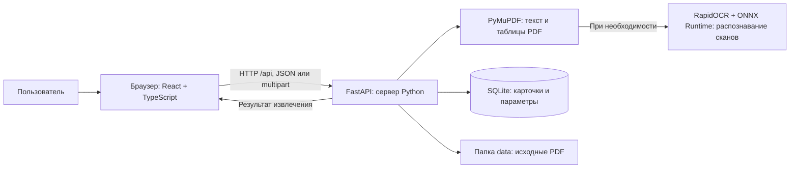
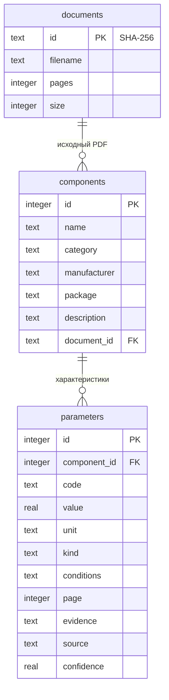

# Как работает каталог «Элемент»

Это локальное веб-приложение для хранения электронных компонентов и их Datasheet. Пользователь выбирает категорию, загружает PDF, проверяет автоматически извлечённые характеристики и сохраняет карточку. Затем компоненты можно искать, редактировать, сравнивать и выгружать в CSV.

## Короткое объяснение для демонстрации

«Приложение состоит из интерфейса в браузере, сервера на Python и базы данных SQLite. Интерфейс отправляет PDF серверу. Сервер сначала проверяет тип компонента, чтобы даташит диода не попал в раздел резисторов. Затем он читает текст и таблицы; если страница является сканом, использует локальное распознавание OCR. Найденные числа переводятся в общие единицы, например миллиамперы — в амперы. Результат возвращается в форму для проверки. Пользователь подтверждает сохранение, после чего сервер записывает компонент и его характеристики в SQLite. Исходный PDF хранится отдельным файлом. Поиск выполняется по базе, а карточка показывает значения, условия измерения и страницы документа, откуда они взяты».

Автоматически заполняется проверяемый черновик. Сам факт распознавания не означает, что все характеристики любого PDF гарантированно найдены или что карточка уже сохранена.

## Архитектура

| Часть | Что делает | Основные файлы |
| --- | --- | --- |
| React + TypeScript | Страницы, формы, навигация, фильтры, сравнение, просмотр PDF | `frontend/src/main.tsx`, `model.ts`, `style.css` |
| Vite | Запуск интерфейса при разработке и сборка статических файлов | `frontend/package.json` |
| FastAPI | HTTP API, проверка входных данных и работа с SQLite | `backend/app/main.py` |
| PyMuPDF | Чтение текста, координат ячеек и таблиц PDF | `backend/app/extraction.py`, `backend/app/layout_extraction.py` |
| RapidOCR / ONNX Runtime | Превращение изображения страницы в текст и координаты | `backend/app/ocr.py` |
| Проверка категории | Определение явного типа компонента в PDF | `backend/app/classification.py` |
| Описания категорий | Параметры форм и столбцы каталогов | `backend/app/categories.py`, `parameters.py` |
| Windows-запуск | Выбор Python, установка зависимостей, запуск сервера и браузера | `START_WINDOWS.bat`, `start_windows.py`, `install_dependencies.py`, `launch_windows.py` |

Это один локальный сервер. В Windows он отдаёт и API, и уже собранный интерфейс из `frontend/dist`. Node.js нужен разработчику для сборки интерфейса; пользователю Windows он не нужен.

## Страницы и действия

Навигация использует адреса после `#`: например, `#/catalog/resistor`. Браузер переключает страницы без полной загрузки сайта. Адрес карточки можно открыть повторно: данные загружаются из API по её идентификатору.

| Страница | Реальное действие |
| --- | --- |
| Обзор | Число записей, документов, производителей и значений; переходы в категории |
| Категории | Диоды, MOSFET, биполярные транзисторы, микросхемы, резисторы, конденсаторы, индуктивности, соединители, источники питания и прочие |
| Каталог категории | Поиск, фильтры, выбор до четырёх компонентов для сравнения, CSV раздела |
| Импорт | Выбор категории и режима, загрузка PDF, проверка типа, автоматическое заполнение, выбор модели и предпросмотр |
| Карточка | Значения, типы min/typ/max, условия, источник и ссылки на страницы PDF |
| Добавление / редактирование | Проверка чисел, выбор единиц и сохранение записи |
| Документы | Список загруженных PDF, поиск по имени и ссылки на связанные карточки |
| Сравнение | Сопоставление параметров одного типа компонента с одинаковым типом значения и текстом условий |
| Справка | Работа с импортом, поиском, единицами, обновлением и Windows |

Одна страница каталога используется для разных категорий, но получает разные параметры. Это уменьшает дублирование кода: например, резистору доступны сопротивление и мощность, а MOSFET — напряжение сток–исток, ток стока и сопротивление открытого канала.

## Что происходит при загрузке PDF

1. Браузер отправляет `POST /api/import`. Запрос `multipart/form-data` содержит файл, выбранную категорию и режим OCR.
2. Сервер проверяет размер, число страниц, читаемость и отсутствие пароля. Ограничения: 20 МБ и 200 страниц.
3. По тексту первых страниц проверяется тип компонента. Характерные обозначения вроде `VRRM`, `VCEO` и `RDS(on)` имеют больший вес, чем упоминание компонента в описании применений. У MOSFET внутренний диод не превращает документ в даташит отдельного диода.
4. При уверенном несовпадении сервер возвращает ошибку `category_mismatch` с правильной категорией. Файл и запись документа в базе не сохраняются. Интерфейс предлагает повторить загрузку в соответствующем разделе.
5. Неоднозначный тип не выдаётся за установленный: пользователь получает предупреждение и проверяет категорию самостоятельно. Раздел «Прочие» допускает различные типы.
6. Сначала PDF разбирается напрямую: это основной путь для электронных Datasheet. Найденные цифровые параметры сохраняются в автоматическом режиме. Если шрифт потерял символ единицы (например, µA превратилось в A), страница всё же проходит OCR: повреждённая единица не считается достоверной.
7. Если нужны сканы, OCR обрабатывает соответствующие страницы. После распознавания категория проверяется ещё раз: неправильный скан тоже блокируется до сохранения.
8. Сервер вычисляет SHA-256 исходного файла. Одинаковый PDF получает один идентификатор и не создаёт несколько записей документа.
9. Исходный PDF сохраняется без изменений. В интерфейс возвращаются название, производитель, корпус, модели, параметры, предупреждения, число страниц и извлечённый текст.
10. Пользователь проверяет результат и нажимает «Сохранить проверенный компонент». Только после этого создаётся карточка компонента.

На неизвестном документе нельзя обещать полноту распознавания без проверки самого файла. Неподдерживаемые характеристики не заполняются выдуманными числами.

## Как извлекаются характеристики

PyMuPDF возвращает текст, координаты слов и реальные границы ячеек. Сначала используется прежний разбор таблиц `SYMBOL` с моделями или `MIN / TYP / MAX / VALUE / RATING`. Дополнительный модуль разбирает таблицы `MIN/TYP/MAX` без `SYMBOL`, каталоги с моделями в строках и таблицы `PARAMETER/SPECIFICATIONS`. Для таблиц без линий заголовки задают физические колонки, а координаты слов — строки. Раздельные блоки заголовка и тела объединяются только при совместимых границах. Повторно напечатанные слова, имитирующие жирный шрифт, удаляются по совпадению координат.

Словарь содержит 58 характеристик. Прямой ток `IF` отличается от среднего `IF_AV`, порог блокировки `UVLO` — от напряжения питания `VCC`, ток вывода земли `IGND` — от выходного тока `IOUT`. Поддерживаются числа `.75`, `0.75` и `0,75`. Название из имени файла служит подсказкой для модели, но численные характеристики берутся из PDF. Параметры рекомендованных внешних компонентов в схемах не становятся вариантами основной микросхемы.

На чертежах извлекаются явно подписанный шаг и число контактов из таблицы позиций. Когда чертёж сокращает обозначение до суффикса, для его применения также требуется полное обозначение серии в документе. Электрические номиналы, отсутствующие в чертеже, остаются пустыми. В каталоге семейства нужно выбрать конкретную модель. У двухполярных выходов сохраняется пояснение о значении каждого плеча; противоречивые подписи MIN/MAX в самом PDF вызывают предупреждение.

[Проверка на архиве data1.zip](DATASHEET_VALIDATION.md) содержит результаты и команду повторного запуска через настоящие API импорта и сохранения.

Положение числа в таблице связывает его с конкретной моделью. Это важно для семейства 1N4001–1N4007: одинаковый ток не означает одинаковое обратное напряжение. Физически объединённая ячейка может относиться к нескольким моделям; обычная пустая ячейка не заполняется значением соседней.

Для параметра сохраняются:

- код, число и базовая единица;
- тип `min`, `typ`, `max` либо `unspecified`;
- условия измерения, например температура или длительность импульса;
- номер страницы и исходный фрагмент;
- способ получения: `text`, `ocr` либо `manual`;
- оценка OCR, если значение получено распознаванием.

Числа нормализуются: `500 mA` хранится как `0.5 A`, `100 µF` — как `0.0001 F`, `10 kΩ` — как `10000 Ω`. Интерфейс переводит их в удобные единицы для показа. Поле ввода сохраняет запятую или точку до завершения редактирования; при сохранении значение превращается в число.

Типовые и предельные значения различаются. Неизвестный тип остаётся «Не указано»; параметр, не найденный в PDF, остаётся незаполненным.

## Как работает OCR

OCR полностью локальный: файл не отправляется внешнему сервису и ключ API не нужен. Модели входят в Python-зависимость RapidOCR.

1. Страница превращается в RGB-изображение при 240 DPI.
2. RapidOCR определяет области текста, распознаёт символы и возвращает координаты с оценками уверенности.
3. OpenCV выделяет горизонтальные и вертикальные линии таблиц.
4. Во временной копии страницы восстанавливаются текст и физические границы ячеек.
5. Та же функция извлечения связывает значения с параметрами и моделями.

Встроенный предпросмотр показывает PNG исходной страницы, подготовленный PyMuPDF: отдельный браузерный PDF-плагин не нужен. Оригинальный PDF можно открыть отдельно. Исходный PDF остаётся прежним. Оценка OCR ниже 90% выделяется жёлтым, но даже 100% не является гарантией правильности. Особенно нужно проверять десятичные точки, единицы и обозначения моделей. После ручной правки значения, типа или условий источник становится `manual`, а оценка OCR очищается. Смена единицы сохраняет источник, поскольку физическое значение не изменилось.

OCR ограничен 10 страницами за импорт и 12 млн пикселей на страницу. Пропущенные страницы перечисляются. Наклон, блики, сложные заголовки и таблицы без линий могут ухудшить результат.

## База и файлы

В папке `data` лежат `catalog.sqlite3` и файлы `<SHA-256>.pdf`. Её можно перенести в новую версию. `CATALOG_DATA_DIR` позволяет разработчику указать другое место хранения.

При запуске сервер добавляет отсутствующие столбцы в старую базу. Старые карточки получают категорию «Диоды»; документы и идентификаторы сохраняются. Изменение карточки и её параметров выполняется в транзакции: ошибка не должна оставить частично обновлённую запись. Повторное обозначение у того же производителя отклоняется. Удаление карточки удаляет её характеристики, но сохраняет исходный документ.

## Поиск, сравнение и экспорт

Поиск названий, производителей и корпусов использует SQL `LIKE`. Дополнительные фильтры преобразуют границы в базовую единицу и проверяют через `EXISTS` один параметр с нужным кодом, типом и условиями. Например, предел `IR ≤ 10 µA` при `TA = 25 C` не должен совпасть с меньшим током, измеренным при другой температуре.

Условия ищутся как текст. Программа не понимает автоматически, что разные записи температуры или испытаний физически эквивалентны.

Сравнение выполняется в браузере по сохранённым данным. Отдельная строка соответствует сочетанию кода, типа и текста условий. Единицы показываются согласованно. Отсутствующее значение отображается как «—»; оно не подменяется нулём.

CSV выгружает весь выбранный раздел: одна строка на значение параметра, с категорией, моделью, условиями и источником. Разделитель — `;`, UTF-8 с BOM удобен для Excel. Опасные начала текстовых ячеек экранируются, чтобы они не исполнялись как формулы.

## Основные HTTP-маршруты

| Метод и адрес | Назначение |
| --- | --- |
| `GET /api/health` | Проверка запуска сервера |
| `GET /api/categories` | Категории, коды параметров и число карточек |
| `GET /api/parameter-definitions?category=resistor` | Названия, единицы и множители параметров раздела |
| `GET /api/stats` | Сводные числа библиотеки |
| `POST /api/import` | Проверка и извлечение из PDF |
| `GET /api/components?category=diode&q=1N4007` | Поиск карточек |
| `GET /api/components/{id}` | Полная карточка |
| `POST /api/components` | Создание после проверки |
| `PUT /api/components/{id}` | Обновление карточки |
| `DELETE /api/components/{id}` | Удаление выбранной карточки |
| `GET /api/documents` | Документы и количество связанных карточек |
| `GET /api/documents/{id}` | Исходный PDF |
| `GET /api/documents/{id}/pages/{number}` | PNG исходной страницы для встроенного предпросмотра |
| `GET /api/components/export.csv?category=resistor` | Экспорт раздела |
| `GET /api/ocr/status` | Наличие локальных зависимостей OCR |

FastAPI также предоставляет техническую схему API на `/docs`. Для обычной работы используется интерфейс приложения.

## Запуск и обновление

В Windows `START_WINDOWS.bat` запускает помощник `start_windows.py`. Он выбирает Python 3.12 (64-bit), поскольку текущая библиотека OCR не поддерживает Python 3.13/3.14. Совместимая среда переиспользуется; при необходимости создаётся `.venv-windows-312`. Старые среды и `data` не удаляются.

`install_dependencies.py` сравнивает отпечаток требований и версии Python с отметкой установки. При изменении зависимостей запускает pip. Отметка пишется только после успешной установки. Затем `launch_windows.py` запускает Uvicorn, проверяет `/api/health` и открывает браузер. Закрытие через Ctrl+C останавливает сервер.

При разработке Python обслуживает API на порту 8000, а Vite — интерфейс на 5173, перенаправляя `/api` к Python. После изменения интерфейса необходимо пересобрать `frontend/dist`: именно эти файлы входят в Windows-архив.

## Как показать проект другому человеку

1. Открыть обзор: категории и счётчики отражают реальные данные.
2. Перейти в «Резисторы» и попробовать загрузить даташит диода: показать блокировку и предложение правильного раздела.
3. Нажать предложенную кнопку: показать автоматически заполненный черновик и PDF рядом.
4. Для семейства выбрать модель и объяснить, почему параметры меняются.
5. Показать единицы, min/typ/max, условия и источник страницы.
6. Сохранить карточку, открыть её после перезагрузки и выполнить поиск.
7. Сравнить две карточки и показать библиотеку документов.

Встроенные учебные PDF содержат вымышленные компоненты и не предназначены для проектирования. Проверки на синтетических примерах подтверждают механику приложения, а не универсальную точность на всех производителях.

## Практические границы проекта

Реализован локальный каталог, без учётных записей и разграничения прав. SQLite подходит для одного локального рабочего места. Сервер Windows слушает только этот компьютер. PostgreSQL, корпоративная PLM-интеграция и многопользовательский доступ потребуют отдельной реализации.

Распознавание поддерживает определённые обозначения и формы таблиц. Категории имеют рабочие формы и поиск, но точность автоматического извлечения нужно измерять на реальных Datasheet каждой группы. Для конкретного сбоя требуется сам PDF и сравнение результата с оригиналом.
